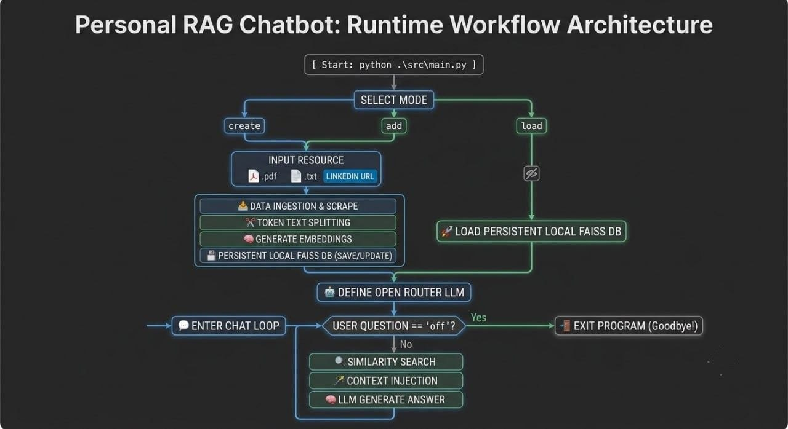

# Personal RAG Chatbot

**Retrieval-Augmented Generation (RAG)** chatbot that enables users to build a personalized knowledge base from local documents or live LinkedIn profiles and interact with it through natural language conversations.

The system combines document ingestion, vector search, and Large Language Models (LLMs) to provide context-aware responses over custom knowledge sources while following a modular and maintainable architecture.

---

## 🚀 Features

* Load and process PDF and TXT documents.
* Ingest LinkedIn profile data through scraping APIs.
* Generate embeddings using local Hugging Face models.
* Store and retrieve vectors using FAISS.
* Support Create, Add, and Load database modes.
* Context-aware question answering using RAG.
* Automatic fallback from `create` mode to `load` mode when no valid data source is provided.
* Fault-tolerant execution with automatic error handling.
* Structured logging for debugging and monitoring.
* Interactive command-line chat interface.

---

## 🏗️ System Architecture

> Replace the image below with your architecture diagram.

<p align="center">
  
</p>

---

## 🔄 RAG Pipeline

1. Load data from PDF, TXT, or LinkedIn profile.
2. Split documents into chunks.
3. Generate embeddings using Hugging Face models.
4. Store embeddings in FAISS.
5. Retrieve relevant chunks through similarity search.
6. Inject retrieved context into the prompt.
7. Generate answers using the LLM.

---

## ⚙️ Runtime Modes

### 1️⃣ Create Mode

Creates a new vector database from scratch.

**Workflow:**

1. Load document or LinkedIn profile.
2. Split text into chunks.
3. Generate embeddings.
4. Create a new FAISS database.
5. Save the database locally.

---

### 2️⃣ Add Mode

Updates an existing vector database with new data.

**Workflow:**

1. Load existing FAISS database.
2. Process new documents.
3. Generate embeddings.
4. Append vectors to the database.
5. Save the updated index.

---

### 3️⃣ Load Mode

Loads an existing vector database without reprocessing documents.

**Workflow:**

1. Load stored FAISS index.
2. Initialize retriever.
3. Start chatting immediately.

---

## 💻 Tech Stack

### Core

* Python 3.11+

### LLM Orchestration

* LangChain
* LangChain Community
* LangChain OpenAI

### Embeddings

* Hugging Face Transformers
* Sentence Transformers

### Retrieval & Vector Database

* FAISS (Facebook AI Similarity Search)

### LLM Provider

* OpenRouter

### Data Processing

* PyPDF
* Recursive Character Text Splitter

### Logging

* Python Logging Module

---

## 📁 Project Structure

```text
Personal-RAG-Chatbot
│
├── src
│   ├── config.py
│   ├── load_split.py
│   ├── Embedding.py
│   ├── setup.py
│   ├── logger_config.py
│   └── main.py
│
├── Data
│   ├── index.faiss
│   └── index.pkl
│
├── logs
│   └── Project.log
│
├── RAG.jpg
├── requirements.txt
├── .env
└── README.md
```

---

## 🔧 Environment Variables

Create a `.env` file in the project root:

```env
API_key=your_openrouter_api_key

base_url=https://openrouter.ai/api/v1

model=openrouter/free

temperature=0.8

chunk_size=100

chunk_overlap=20

embedding_model=sentence-transformers/all-MiniLM-L6-v2

X-API_KEY=your_scraping_api_key

url=your_scraping_api_endpoint

DB_path=./Data
```

---

## 🚀 Installation

### Clone the Repository

```bash
git clone https://github.com/abdelwahab798/Personal-RAG-Chatbot.git

cd Personal-RAG-Chatbot
```

### Install Dependencies

```bash
pip install -r requirements.txt
```

---

## ▶️ Running the Application

### CLI Mode

Run:

```bash
python .\src\main.py
```

You will be prompted to choose one of the following modes:

```text
create
add
load
```

---

### Input Sources

For **create** and **add** modes, provide one of the following:

* PDF file
* TXT file
* LinkedIn Profile URL

Example:

```text
https://linkedin.com/in/example-profile
```

---

## 💬 Chat Session

After the vector database is loaded successfully:

```text
[INFO] - DB Loaded Successfully
```

You can start asking questions about your documents or ingested LinkedIn profiles.

To terminate the session:

```text
off
```

---

## 📜 Logging

Application logs are automatically stored in:

```text
logs/Project.log
```

The logging system tracks:

* Database operations
* File processing
* Similarity search operations
* Runtime exceptions
* Application lifecycle events


---

## 👨‍💻 Author

**Abdelwahab Amr**

* AI & Data Scientist
* Software Engineering Student
* Machine Learning & RAG Developer

GitHub:
https://github.com/abdelwahab798
